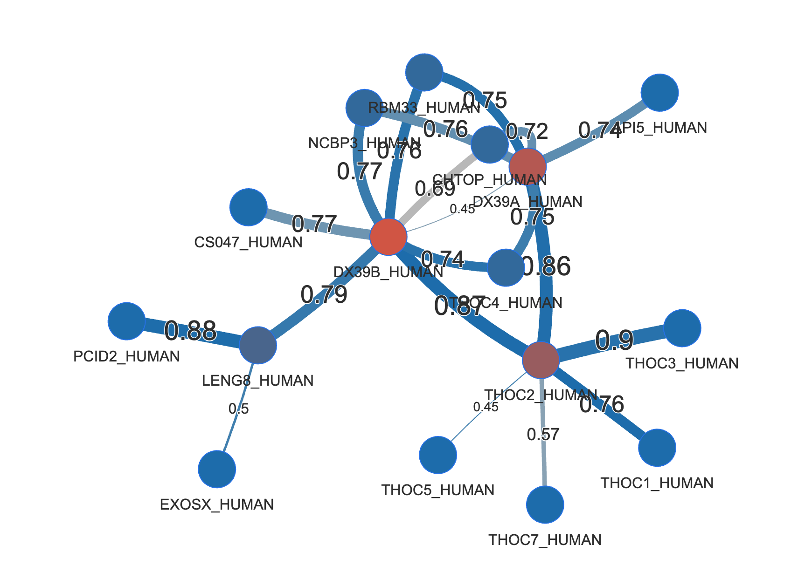
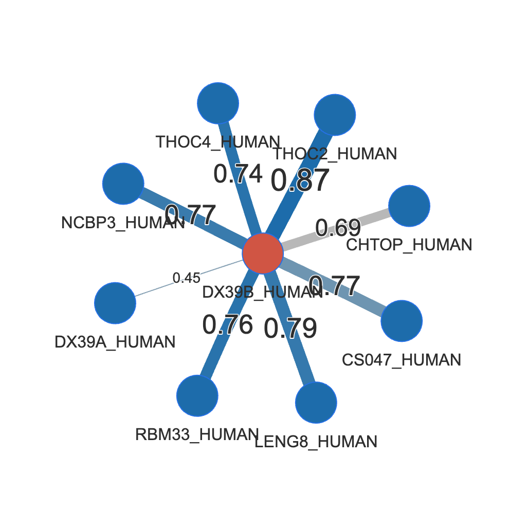
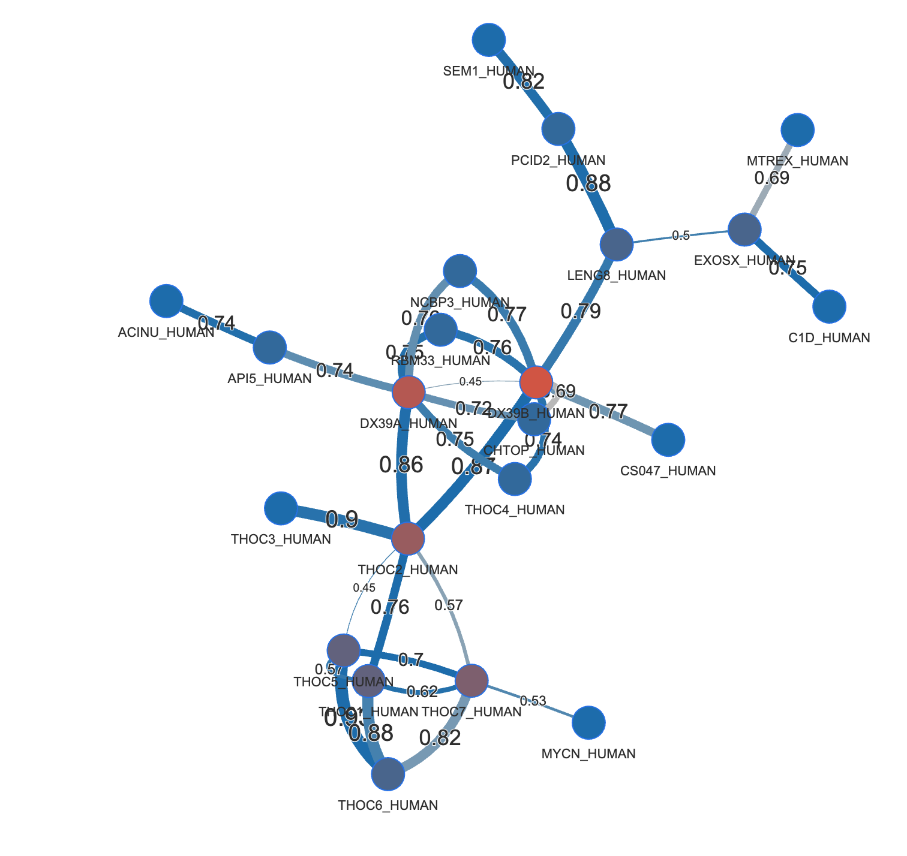
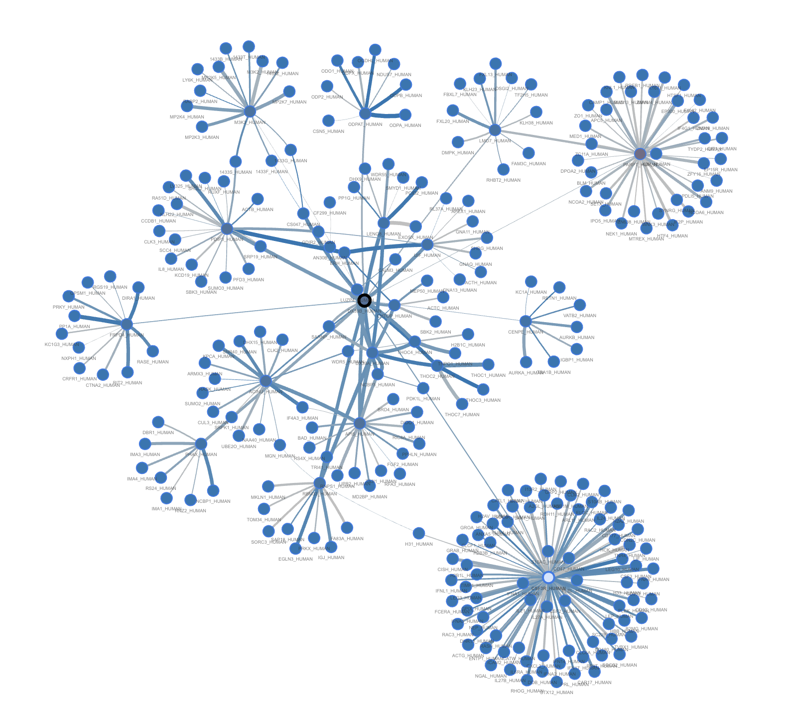
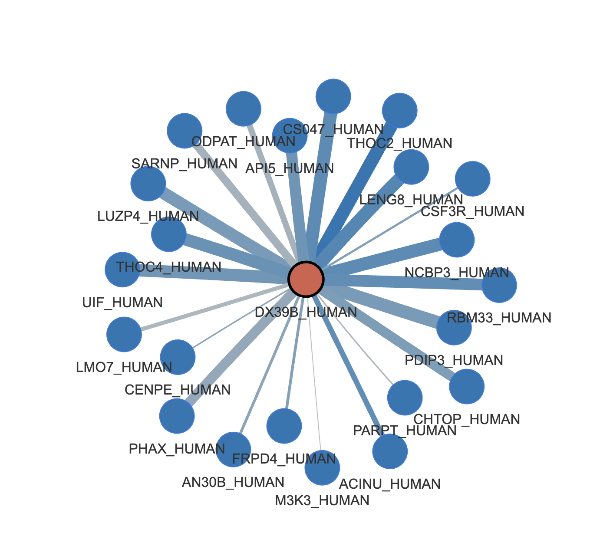
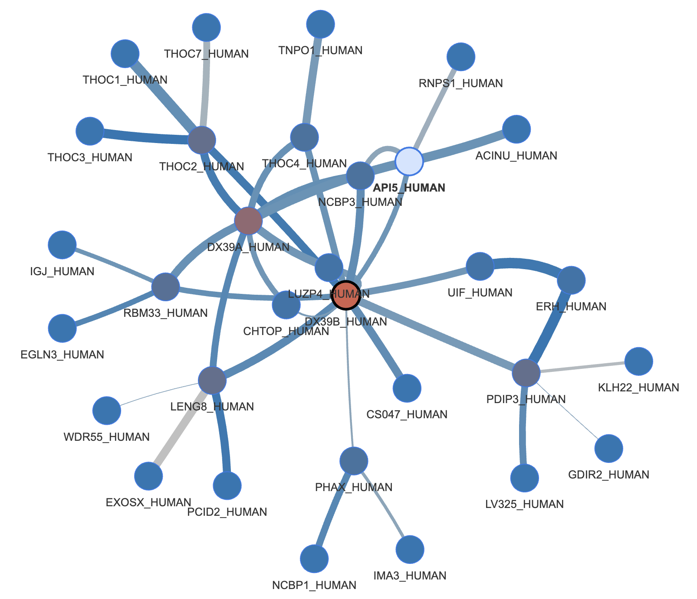

# predictomes-vis

## TL;DR / Quick Start
- Network (FDR): `/resources/AF2_PPI_tools/predictomes_vis.sh network --metric FDR --poi A1AG2_HUMAN --expansion-depth 0`
- Network (peak_score): `/resources/AF2_PPI_tools/predictomes_vis.sh network --metric peak_score --poi A1AG2_HUMAN --peak-threshold 0.75 --expansion-depth 1`
- Binary plots: `/resources/AF2_PPI_tools/predictomes_vis.sh binary --poi A1AG2_HUMAN --outdir /tmp/predictome_binary_plots`
- Help: run `predictomes_vis.sh --help`, `predictomes_vis.sh network --help`, `predictomes_vis.sh binary --help`.

## Overview

Toolkit for visualizing AF2-based protein-protein interaction predictions (PPI) from the [predictomes](https://predictomes.org/hp/) website as reported in [Schmid et al.](https://www.biorxiv.org/content/10.1101/2025.11.10.687652?__cf_chl_tk=Tq5jkyy33O_VjEr9nfsezuPx1TG.H_rIUJCNS0_L_SY-1763463674-1.0.1.1-cIIZHc5NLOsEFrkd3H8iBHS27C52DMB2gljvQmt7tu0).

In addition to the confidence metrics available on the website, this tool allows visualising the "peak score" metric implemented by Dominik Handler in the VBC [HT-Alphafold](https://gitlab.com/BrenneckeLab/ht-colabfold) pipeline, which is more sensitive to small interfaces in large proteins. This score was extracted for the complete set of 1.6 million predictions.

## Plotting modes

The script provides two main modes of operation:

- **network** mode: build PPI networks from predictions around your protein of interest (POI). The user can control the depth of the network (i,e ., direct neighbors only, or neighbors of neighbors, etc.) and the scoring metric used to filter predictions using a --metric keyword. Two metrics are supported:
  - annotated high-confidence predictions results (<10% FDR, using the SPOC score) (set of ~16000 high-confidence predictions provided in `20251113_download_hsbps.csv`)
  - **peak_score**: Peak scores extracted from the full predictome matrix (1.6 million predictions, provided in `predictome_json_stats_251115/json_metrics_matrix.tsv`)
- **binary** mode: One-vs-all plots for your poi mimicking the [HT-Alphafold](https://gitlab.com/BrenneckeLab/ht-colabfold) output for your POI (ptm/iptm/peak scatter, beeswarm, histograms) from the predictome matrix.

>**Note** You can switch between network and binary modes by providing the respective keyword as first argument to the script (see examples below).

## Running on CLIP (VBC cluster)

The tool is installed as a container that bundles both data sources:
- `20251113_download_hsbps.csv` (high-confidence SPOC, FDR mode)
- `predictome_json_stats_251115/json_metrics_matrix.tsv` (predictome matrix, peak_score mode)

For easy execution, a wrapper is available on the host.  Below are some example commands.


### Getting started 
Help pages for the various modes are available via:
```
/resources/AF2_PPI_tools/predictomes_vis.sh --help
/resources/AF2_PPI_tools/predictomes_vis.sh network --help
/resources/AF2_PPI_tools/predictomes_vis.sh binary --help
```

### Example usages - network display


##### Displaying networks using high confidence predictions at various depths 

Here is a simple example using DX39B_HUMAN (DEAD-box helicase 39B) as protein of interest (POI), using default parameters:

```bash
# Network mode, high confidence interactors with FDR<10% (default), displaying predicted neighbors and their neighbors (default behaviour):
/resources/AF2_PPI_tools/predictomes_vis.sh network --poi DX39B_HUMAN
```
Outputs are saved to `outputs/ppi_networks/DX39B_HUMAN/` by default and can be visualised using the generated HTML file in a web browser. THis example looks like this:


**Explanation of the plot**
- The network shows DX39B_HUMAN (red node) connected to its predicted interactors (blue nodes). 
- **Node colors** correspond to how many predicted interactions each protein has in the network.
- Hovering over a node shows the **Uniprot "Function"** annotation for that protein (Note: For very large networks, fetching this information from uniprot can be slow. Therefore, the script asks you if you want to fetch that information when your network has more then 100 proteins in it, and if yopu don't reply it will  skips this step after 30s of inactivity). You can change the threshold for this prompt using the ` --large-network-threshold` argument.
- The **width of an edge** (=connection between proteins) widths correspond to the SPOC score
- The **color of an edge** correspond to the maximum ipTM score observed across all 3 predictions between the two proteins.
- Additional scores are displayed when you hover with the mouse over and egde
- You can (somewhat) interact with the network by zooming in/out and dragging nodes around.


```bash
# Network mode, high confidence interactors with FDR<10% (default), displaying only direct predicted neighbors, using only high-confidence predictions) :
/resources/AF2_PPI_tools/predictomes_vis.sh network --poi DX39B_HUMAN --expansion-depth 0
```



This plot looks like this:

```bash
# Network mode, high confidence interactors with FDR<10% (default), displaying two layers of neighbors, using only high-confidence predictions) :
/resources/AF2_PPI_tools/predictomes_vis.sh network --poi DX39B_HUMAN --expansion-depth 2
```

This plot looks like this:


>**Note**: Networks with large expansion depths may become very large and slow to generate and visualize. 


#### Displaying networks using the peak_score metric from the full predictome matrix

>**Warning**: The peak score may detect interactions with small interfaces between large proteins, but is prone to false positives and alone is not a reliable indicator of interaction confidence. Use with a bigger grain of salt!

```bash
# Network mode, using the peak_score metric at the default peak score cutoff of 0.75 
/resources/AF2_PPI_tools/predictomes_vis.sh network --metric peak_score --poi DX39B_HUMAN
```

The plot looks like this:


Note that the network is much larger than when using the high-confidence SPOC predictions only, as many more interactions are detected using the peak_score metric. This propably includes many false positives!

To reduce the number of interactions shown, you can either increase the peak score threshold or reduce the expansion depth. For example:
```bash

# Network mode, using the peak_score metric at the default peak score cutoff of 0.75 and no expansion (direct neighbors only):
/resources/AF2_PPI_tools/predictomes_vis.sh network --metric peak_score --poi DX39B_HUMAN --expansion-depth 0
```
The plot looks like this:


Or we can increase the threshold 
```bash

# Network mode, using the peak_score metric at a higher cutoff of 0.9 and two layers of neighbors:
/resources/AF2_PPI_tools/predictomes_vis.sh network --metric peak_score --poi DX39B_HUMAN  --peak-threshold 0.9
```
Where we get:



## Binary plots (one-vs-all metrics, Handler-style):

These plots show prediction statistics for your POI against all tested proteins (1.6 million pairwose prediction set, see [Schmid et al.](https://www.biorxiv.org/content/10.1101/2025.11.10.687652?__cf_chl_tk=Tq5jkyy33O_VjEr9nfsezuPx1TG.H_rIUJCNS0_L_SY-1763463674-1.0.1.1-cIIZHc5NLOsEFrkd3H8iBHS27C52DMB2gljvQmt7tu0) for details ), in plots similar to the HT-Alphafold output. Propably the only option yuo ever might want to change is the output directory using `--outdir`.

```bash
/resources/AF2_PPI_tools/predictomes_vis.sh \
  binary --poi DX39B_HUMAN
```

Defaults:
- Output dirs: `outputs/ppi_networks` (network) and `outputs/predictome_binary_plots` (binary)
- DOT/PNG disabled by default; JSON/PyVis enabled for network outputs.
- Predictome matrix path is set via `PREDICTOMES_PEAK_MATRIX` inside the container.

# Batch processing
Both `network` and `binary` modes support batch processing of multiple POIs by providing either:
- multiple comma or white-space seperated inputs to the --poi argument
- a text file with your POIs supplied using the  `--poi-list` argument. The inputs can be comma or white-space seperated, or across different lines.


```bash
## Notes
- POI can be UniProt ID or entry name; unmatched POIs suggest closest matches.
- Large network function-fetch prompt times out after 30s and skips by default.
- When using peak_score metric, edges default to width = `peak_avg_norm`, color = `iptm_max`. 
